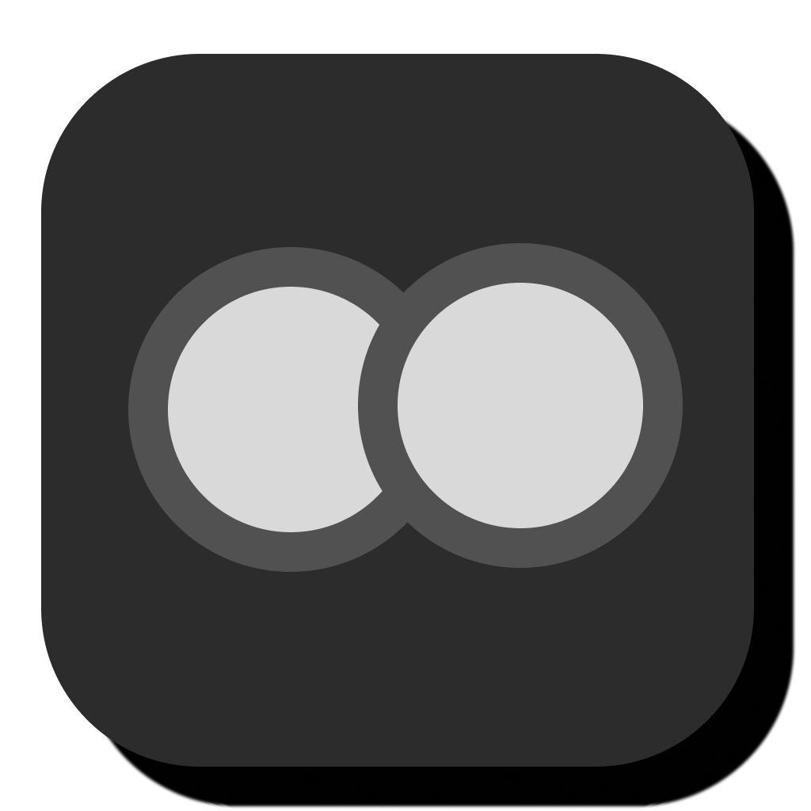
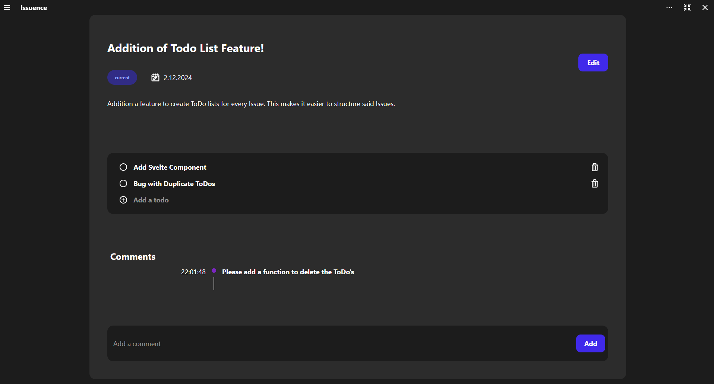

### Why Issuence?
With `Issuence` you split your tasks into smaller issues and manage them with ease.
Instead of having a miles long ToDo-list, you now can have a structured list of issues, featuring comments to quickly add notes or ideas.

To be continued...
